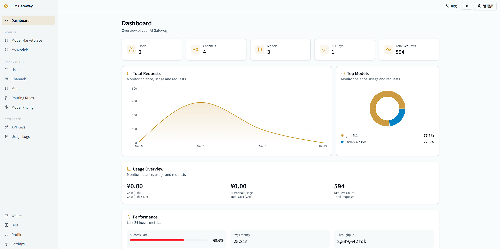

# AI Gateway

A reverse proxy gateway for large language model APIs. Provides a unified OpenAI-compatible endpoint that routes requests to upstream providers with channel management, load balancing, usage tracking, rate limiting, and a full-featured admin UI with wallet/billing management.

[中文文档](./README_zh.md)

## Features

- **Unified API** — Single endpoint compatible with OpenAI and Anthropic API formats
- **Channel Management** — Route requests to multiple upstream providers with weight-based load balancing and health checks
- **Model Marketplace** — Browse, subscribe, and publish models through the admin UI
- **API Key Management** — Multi-key support with user binding and granular permissions
- **Usage Tracking** — Token counting, cost calculation, aggregate charts, and detailed usage logs with deduplication
- **Rate Limiting** — Per-key and per-user rate limits
- **Wallet & Billing** — Balance management, recharge (manual and key-based), transaction history, low-balance alerts, and estimated days remaining
- **Recharge Key Management** — Create, revoke, and filter recharge keys with optional expiry and usage tracking
- **User Management** — Admin panel for user creation, role assignment, and activity monitoring
- **Custom Routing Rules** — Define routing logic per model or API key
- **Redis Caching** — Exact cache for non-streaming requests
- **SSO** — OIDC-based single sign-on
- **Health Checks** — Monitor upstream model connectivity and channel status



## Quick Start

### Docker Compose (recommended)

```bash
cp config/config.yaml config/config.local.yaml
# Edit config/config.local.yaml as needed
docker compose up -d
```

The gateway and admin UI will be available at `http://localhost:8080`.

### Manual Build

```bash
# Backend
cargo build --release
./target/release/ai-gateway

# Frontend development (separate terminal)
cd ui
pnpm install
pnpm run dev    # Serves on :5173 with hot reload, proxies API to :8080

# Build frontend for production (output to ../web/)
cd ui && pnpm run build
```

## Configuration

Edit `config/config.yaml`. Key settings:

| Setting | Description | Default |
|---------|-------------|---------|
| `server.host` | Listen address | `0.0.0.0` |
| `server.port` | Listen port | `8080` |
| `admin.username` | Admin login username | `admin` |
| `admin.password` | Admin login password | `admin123` |
| `database.path` | SQLite database path | `data/gateway.db` |
| `jwt_secret` | JWT signing secret | `${GATEWAY_JWT_SECRET}` |
| `cache.enabled` | Enable Redis cache | `false` |
| `cache.redis_url` | Redis connection URL | `redis://127.0.0.1:6379` |

Environment variables in config (`${VAR_NAME}`) are resolved from `.env` or environment.

## Usage

### API Endpoints

Compatible with OpenAI and Anthropic SDKs:

```bash
curl http://localhost:8080/v1/chat/completions \
  -H "Authorization: Bearer <your-api-key>" \
  -H "Content-Type: application/json" \
  -d '{"model": "gpt-4", "messages": [{"role": "user", "content": "hello"}]}'
```

### Admin UI

Open `http://localhost:8080/` in browser. Log in with admin credentials from config.

## Architecture

```
                    ┌─────────────┐
                    │   Clients   │
                    └──────┬──────┘
                           │
                    ┌──────▼──────┐
                    │  AI Gateway │
                    │  (Axum/Rust)│
                    └──────┬──────┘
                           │
              ┌────────────┼────────────┐
              ▼            ▼            ▼
        ┌──────────┐ ┌──────────┐ ┌──────────┐
        │ OpenAI   │ │Anthropic │ │  vLLM    │
        │ Channel  │ │ Channel  │ │ Channel  │
        └──────────┘ └──────────┘ └──────────┘
```
